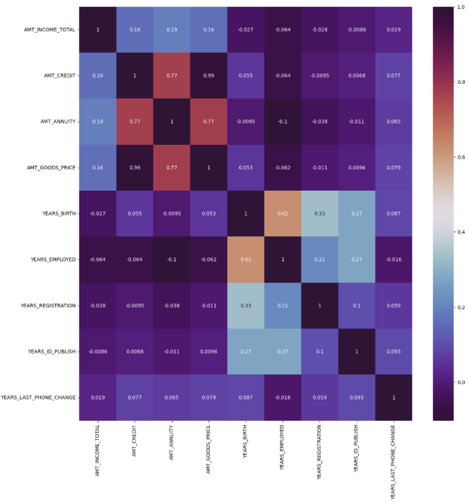
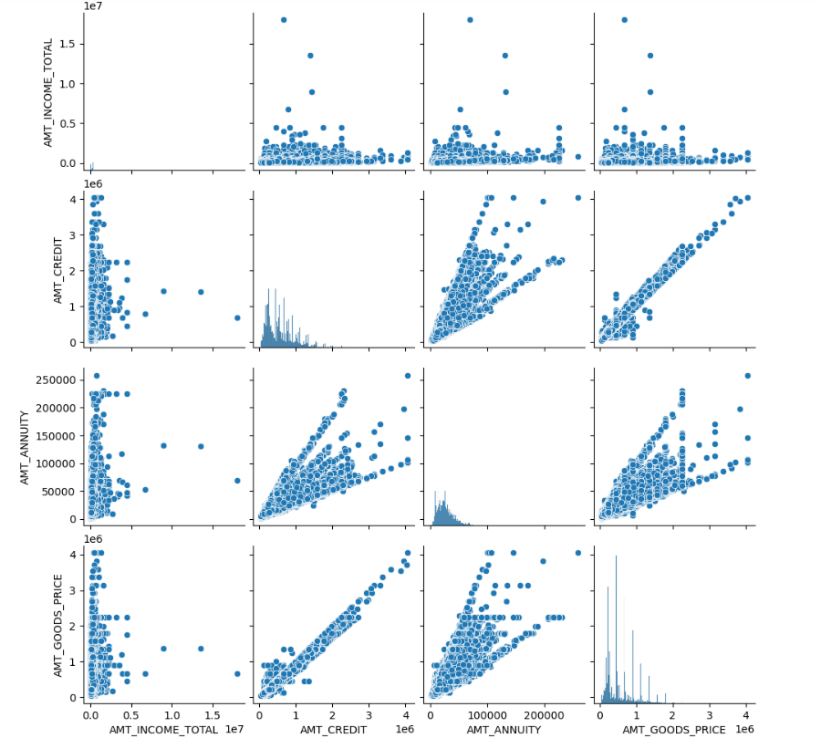
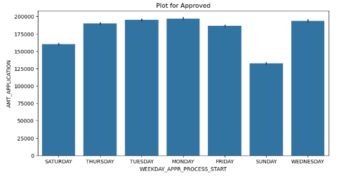

# Credit Data Exploratory Analysis (EDA)

This project involves performing exploratory data analysis on a credit dataset to uncover key trends and patterns that can impact credit scoring, customer profiling, and risk analysis.

---

## Tools & Technologies Used

- **Python** – Data handling and analysis
- **Pandas, NumPy** – Data manipulation
- **Matplotlib, Seaborn** – Data visualization
- **Jupyter Notebook** – Interactive analysis

---

## Key Analysis Performed

- Loaded and cleaned the credit dataset (handled missing values, data types)
- Explored distributions of key variables like age, income, credit amount, and loan status
- Created visualizations to understand:
  - Correlations between features
  - Credit risk trends across income and age groups
  - Distribution of credit purpose and duration
- Identified patterns that may be used for further predictive modeling

---

## Sample Visualizations

- Heatmap of correlations
- Pair Plot
- Bar chart 

---

## Outcome

- Gained valuable insights into customer credit behavior and risk indicators
- Prepared the dataset for future modeling tasks (classification, scoring)
- Delivered a clean and organized Jupyter Notebook suitable for portfolio

---

## Next Steps

- Apply logistic regression or classification models on this data
- Use feature importance to understand credit score drivers

---
